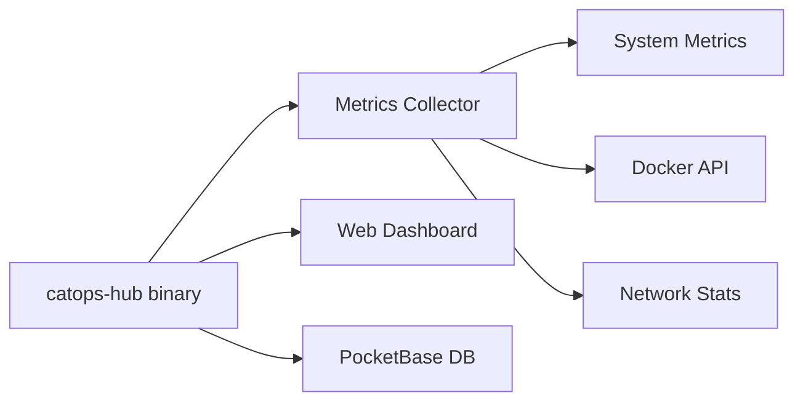

CatOps Hub is a lightweight, self-hosted server monitoring dashboard. It provides real-time metrics, Docker container management, and a beautiful web interface.

## Features

<AccordionGroup>
  <Accordion title="Real-time Metrics">
    Monitor CPU, memory, disk, and network usage with automatic 10-second refresh. View historical data in interactive charts.
  </Accordion>
  <Accordion title="Docker Integration">
    - View all containers (running and stopped)
    - Container resource usage (CPU, memory)
    - Live log streaming
    - Start, stop, restart containers
  </Accordion>
  <Accordion title="Service Detection">
    Automatic detection of running services:
    - nginx, Apache
    - PostgreSQL, MySQL, MongoDB
    - Redis, Memcached
    - Node.js, Python, Go
    - And more...
  </Accordion>
  <Accordion title="Network Monitoring">
    - Active network connections
    - Listening ports
    - Process information
  </Accordion>
</AccordionGroup>

## Requirements

| Requirement | Details |
|-------------|---------|
| OS | Linux (Ubuntu, Debian, CentOS, etc.), macOS, FreeBSD |
| Architecture | x86_64, ARM64, ARM |
| Access | Root access for installation |
| Port | 8090 (configurable) |

## How It Works

1. **Single Binary** - Hub is distributed as a single executable (~15MB)
2. **Metrics Collection** - Collects system metrics every 10 seconds
3. **Local Storage** - Data stored in embedded PocketBase database
4. **Web Interface** - React dashboard served from the binary
5. **Cleanup Job** - Automatically removes old data based on retention period

## License

CatOps Hub requires a license to operate.

| Plan | Price | Retention | Containers |
|------|-------|-----------|------------|
| Personal | $5/mo | 24 hours | Up to 10 |
| Pro | $12/mo | 30 days | Unlimited |

<Card title="Get a License" icon="key" href="https://catops.app/hub">
  Purchase a license at catops.app/hub
</Card>
